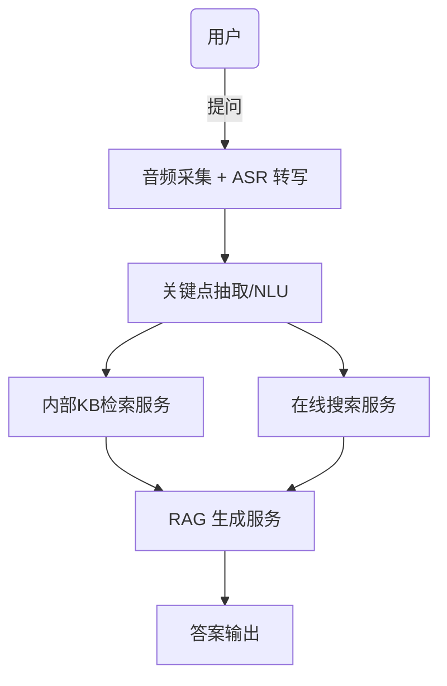
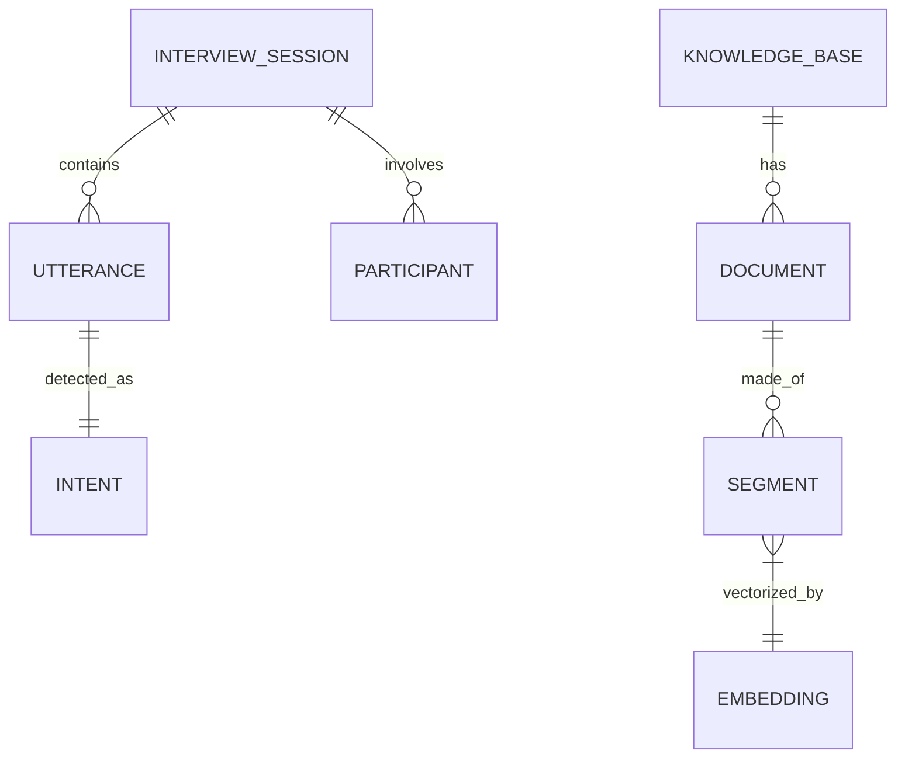

# 执行摘要

本方案面向线上面试助手场景，设计了一个端到端的实时语音问答系统架构。系统全程采集面试官与面试者音频，通过高精度ASR实现无错转写，并使用NLP技术提取问题关键信息；先在内部知识库检索相关文档，若无匹配再调用在线搜索；最后通过检索增强生成（RAG）结合大模型生成答案。架构采用微服务+事件总线，前端使用WebRTC/Web Audio实时采集音频并展示UI，后端分为ASR服务、NLU模块、检索服务、LLM生成服务等，并使用Elasticsearch进行向量+关键词混合检索。系统需要保证近实时响应（端到端延迟建议≤2秒），支持适量并发（并发会话数**未指定**，可水平扩展），并采用本地优先录音+全链路加密等措施满足隐私合规要求（例如GDPR/中国PIPL规定）。下文将逐项详细说明架构设计、技术选型、接口示例、性能目标及安全合规方案。

# 1. 维度与约束

- **并发面试数量**：**未指定**（可设计为数十至上百会话并行）。架构应支持容器化/Kubernetes扩展，根据负载自动增减实例。  
- **延迟要求**：要求**近实时**交互。理想情况下**端到端响应延迟**在1–2秒内（包括ASR转写、NLU处理、检索和生成）。各环节目标延迟：ASR数十毫秒级增量输出，NLU/检索<200ms，LLM生成1–3秒。  
- **隐私/合规**：录音存储期限需符合内部策略。根据GDPR、中国PIPL等法规，应得到双方同意并仅保存必要内容。采用**本地优先采集**、**加密传输存储**、**访问控制与审计**等措施【8†L68-L72】【8†L72-L80】。例如，录音与转写文本传输全程使用TLS，加密后存储（使用客户管理密钥）；日志和导出需脱敏；不必要时删除原始音频。  
- **支持语言**：**未指定**，假设至少支持面试官使用的母语（如中文）。可选用多语ASR和大模型保证语种灵活。  
- **部署环境**：**未指定**。可根据隐私需求选**本地部署**或**私有云/混合云**。涉密场景建议部署在内网GPU集群；若使用云服务需签署合规协议（BAA等）。  
- **预算/许可**：**未指定**。优先考虑开源方案（例如OpenAI Whisper、Rasa、Haystack、Elasticsearch等）；必要时结合商用API（Azure OpenAI/GCP/DingTalk AI等）以提高开发效率。

# 2. 核心技术与大模型

- **ASR 模型选择与微调**：使用性能领先的ASR系统，如OpenAI Whisper【19†L9-L17】、Facebook Wav2Vec 2.0、商用离线SDK（讯飞、阿里云等）。Whisper通过68万小时弱监督训练，可**零样本**通用识别，对常见场景达到近人类准确度【19†L9-L17】。根据面试语音特点（语速、专业词汇），可对模型进行领域微调或使用**语言模型重打分**。  
- **流式转写实现**：前端通过WebRTC/Web Audio获取音频流，采用WebSocket或gRPC将音频块发送到后台ASR微服务。ASR服务采用流式模型（如部署Whisper流式版或Vosk/Kaldi服务），实时返回增量文本片段，并维护时间戳和置信度。可结合**断句**算法输出完整句子。流式实现确保实时性，同时可在后台合并结果。  
- **语音增强/分离**：若需要区分面试官与应试者或减少噪声，可在ASR前加入语音处理模块。采用深度学习降噪/回声消除（如RNNoise、SpeexDSP）和说话人分离模型（Conv-TasNet、SpeechBrain Toolkit【41†L998-L1001】等）将音频解混。这样可以只将面试官语音送入NLU，提高识别准确率。语音活动检测可帮助分段对话。  
- **ASR后处理纠错**：对ASR输出结果使用**拼写和语法校正**。方法包括：使用大语言模型（如GPT-4/GPT-4o/Claude）进行零/少样本纠错【36†L88-L97】；或训练专门的Seq2Seq纠错模型（BART/T5架构）在ASR输出和参考文本上学习纠错规则【36†L88-L97】。此外可对专有名词、技术术语做额外校验（例如与知识库对比修正）。实体识别后校验常见实体词拼写。实验证明此类**后处理**可显著降低ASR误差【36†L88-L97】。  
- **说话人识别/对话分段**：结合录音信号特征做说话人识别，如果需要分离面试官和被面者的语音轨迹。可以使用VoiceId或类似模型进行说话人嵌入匹配。分段算法（VAD）可在无声处切分，构建对话轮次，方便NLU处理。  
- **指代消解**：对于涉及前情提及的提问（如“它”、“这样做”），在NLU中加入基于上下文的指代解析。可调用SpaCy/AllenNLP等工具实现简单共指消解，或直接在大模型Prompt中附加上下文片段进行答复，确保理解前后文。  
- **意图/关键点抽取**：设计丰富的自然语言理解管道，对面试官问题进行深度解析。除了传统意图分类，还要**抽取关键实体/槽位**。例如使用微调BERT/ERNIE模型标注问题中的专业名词、技术点等；或使用大模型开AI接口**提炼问题关键子句**。  
  - *示例*：如果面试官问“在 LoRA 微调中，*rank* 和 *lora_alpha* 等关键超参数分别有什么作用？”，系统首先识别出关键术语“LoRA”、“rank”、“lora_alpha”、“超参数”。然后构造检索词`"LoRA rank lora_alpha 超参数"`以查询内部知识库。检索到相关文档后，形成Prompt：“问题：‘LoRA rank lora_alpha 超参数的作用是什么？’ 相关资料：[文档段落] 请根据资料回答并说明来源。”由LLM生成最终答案。  
  - 上述流程利用关键点抽取生成具体检索Query和RAG提示，提高了问答准确率和可解释性。  
- **检索增强生成（RAG）流程**：系统在接收到问题后，先使用提取的关键词向量和全文检索器在内部知识库中查询相关文档片段。内部KB可为企业文档库、过往面试题库、培训资料等。若KB无明显命中，再调用在线搜索API（如Bing Custom Search或Google Search）获取网页摘要。所有检索内容与原问题一起传给大模型（如ChatGPT-4、Claude3、Llama3等）作为Prompt的上下文【26†L27-L35】。大模型根据这些信息生成答案，并附带引用。NVIDIA RAG参考架构建议使用**混合检索**（稠密向量+稀疏关键词）和“文档再排序”等技术提升效果【26†L50-L57】。  
- **检索器与向量化策略**：对知识库和网络结果使用相同Embedding模型（如OpenAI TextEmbedding Ada、Sentence-BERT或开源ERNIE等），将文档拆分后向量化【26†L50-L57】。在Elasticsearch中建立索引，使用`dense_vector`字段存储句向量，`text`字段用于关键词（BM25）检索。查询时结合`knn`向量查询和关键词匹配【30†L231-L240】。Elasticsearch 8.x可通过`rrf`或`combination`检索器并行执行向量与BM25查询，返回融合结果【30†L231-L240】。  
- **知识库同步与写入**：内部知识库更新后需及时重建或增量更新向量索引。可采用定时批量处理或监听变更的方式，保证数据“近实时”可用。Elasticsearch索引配置应开启近实时刷新（如默认1秒）【45†L1001-L1006】，并采用Bulk API批量写入向量。对于新增文档，立刻索引以免遗漏。  
- **在线搜索集成**：选用可靠的搜索API（考虑速率、成本与隐私）。将问题转换为适合搜索的Query（可直接使用关键点或扩展同义词），获取Web文档摘要。需对返回结果做清洗（去广告、重复），并去除可能敏感内容。检索到的内容同样向量化并存入临时索引，以供LLM参考。  
- **结果融合与置信度**：将来自内部KB和网络的答案片段综合后，给出统一回复。可以对内部资料检索结果赋予更高权重。使用LLM时，如果生成答案和提供证据不符，则评估置信度；如果置信度低于阈值，则提示用户更正或补充信息。参考NVIDIA设计，系统可执行“反思”（让模型判断答案可靠性）以提高质量【26†L50-L57】。  
- **隐私保护**：在系统设计中引入差分隐私与加密策略。如使用**差分隐私**技术在模型训练或统计输出时保护个人数据。尽量避免在网络调用时传输敏感信息，对日志统一脱敏并只记录不含个人标识的内容【8†L68-L72】。敏感流程（如检索、生成）优先在本地推理完成，减少外泄风险。 

# 3. 企业级Agent框架对比

| 框架/平台           | 优点                                                 | 缺点                                                 | 适用场景                                    | 与RAG/ASR/向量集成难度                    |
|--------------------|------------------------------------------------------|------------------------------------------------------|-------------------------------------------|------------------------------------------|
| **Rasa**           | 开源可本地部署；高度可定制NLU和对话流；隐私可控【2†L33-L42】     | 学习曲线较陡；默认文本会话，需要自行接入ASR；对话管理需配置 | 复杂业务逻辑、高度定制化、私有部署场景【2†L47-L54】 | 中等：可通过自定义Action调用RAG/向量服务；需编写ASR/Webhook接口 |
| **Botpress**       | 图形化对话编辑器；插件丰富；快速原型                      | 社区版功能有限；深度定制不及Rasa；企业版付费       | 需要可视化工具、快速搭建聊天流程的场景     | 中等：可接自定义模块实现检索/RAG；需开发插件适配ASR |
| **MS Bot Framework** | 企业级支持多通道接入；配合Azure Cognitive服务（LUIS、Speech） | 重度依赖Azure；复杂度高；本地部署复杂             | 微软生态、跨平台多渠道场景；需要高可用性     | 较高：可使用Azure LUIS做NLU，Azure Search做RAG；需配置Webhook调用 |
| **Google Dialogflow** | 云服务，NLU强大；易于设置；支持多语言              | 数据存在Google云；自定义程度一般；需付费   | 快速开发、需要简便部署的对话系统             | 中等：支持Webhook集成RAG/ASR，需要后端对接逻辑 |
| **IBM Watson Assistant** | 企业级平台；支持权限管理合规；多渠道          | 商业付费；自定义灵活度较低                    | 企业客服、需要IBM生态和合规支持场景          | 中等：通过API连接外部RAG/ASR服务；具备监控和安全特性 |
| **LangChain/LLM管道** | 极高灵活性，专注RAG和多智能体；集成主流向量库 | 非传统“框架”，需编程实现；缺UI界面           | 开发自定义知识型助手、需要多Agent协作的复杂任务 | 低（开发者友好）：原生支持向量搜索、ASR/LLM集成，需手写流程代码 |
| **Haystack (deepset)** | 专业RAG框架（检索+生成）；Python生态好 | 缺少对话管理功能；需自行开发前端             | 知识问答系统、需要RAG流水线集成            | 低：内置文档加载、向量检索和LLM调用；可连接ASR转写接口 |

*注：表中信息参考Rasa官方文档和相关对比【2†L33-L42】【26†L50-L57】；集成难度项为经验估计。*

# 4. 开源项目推荐与复用

下面列出可在本系统中复用的开源项目示例及作用：

| 开源项目          | 功能/组件               | 本系统复用方式示例                                    |
|-----------------|----------------------|-------------------------------------------------|
| **OpenAI Whisper**【19†L9-L17】 | 语音识别模型             | 用于实时流式ASR转写，支持多语种高精度识别；可微调适应语料。    |
| **SpeechBrain**【41†L998-L1001】  | 语音工具包（ASR/分离/增强） | 用于预处理：语音分离、降噪、VAD；也可用于定制ASR或说话人验证。  |
| **Rasa NLU/Core**【2†L33-L42】     | 对话管理与NLU           | 用于问题意图和实体识别；结合自定义Action将问题转发至检索/RAG。  |
| **LangChain**    | LLM 管道与多智能体       | 构建多轮对话和RAG流水线，如拆分子任务、加载LLM与向量DB的工具。    |
| **Haystack**     | 检索增强生成框架        | 管理文档索引、向量检索和QA流程，可直接调用ASR文本作为问句输入。 |
| **Elasticsearch (向量支持)**【30†L231-L240】【45†L1001-L1006】 | 向量+关键词检索引擎     | 存储知识库文本及嵌入。使用dense_vector字段实现kNN搜索，配合BM25。 |
| **Milvus/Weaviate** | 向量数据库           | 可替代ES存储向量。若数据量大或需要GPU加速检索，可使用此类数据库。 |
| **HuggingFace Transformers** | 预训练模型库        | 提供NER、BERT意图分类、纠错等模型，可用于微调ASR纠错、意图识别等。 |

上述项目可作为“乐高积木”组合使用，例如：Whisper转写后文本送入Rasa NLU做意图识别，再用LangChain/Haystack执行检索并调用GPT生成答案；Elasticsearch或Milvus存储文档向量并提供检索接口。

# 5. 技术栈与系统架构

## 前端

- **音视频采集**：使用WebRTC/WebAudio API实时采集麦克风音频流。若需要视频（显示面试官等），可用MediaDevices获取摄像头输入。  
- **用户界面**：建议采用现代前端框架（如React、Vue）构建仪表盘，展示实时转写文本、提示信息、回答输出等。界面包含对话文本框、录音回放控件、问题提示板块（显示关键词、历史问题）。  
- **可视化面试提示**：实时高亮关键字、计时器（面试时间）、可能的提示问题（如基于知识库自动推荐相关问题）。  
- **回放功能**：录音结束后，可提供一键回放当次对话音频，帮助用户复盘或复核答案。可利用HTML5 Audio或第三方播放库。  

## 后端

- **流式ASR服务**：部署独立微服务（如FastAPI、gRPC服务），接收音频流并调用ASR模型推理，返回JSON格式增量文本。可使用Docker容器化部署，并支持GPU或加速库（如NVIDIA Riva ASR）。  
- **事件总线**：使用Kafka、RabbitMQ或Redis Streams作为消息中间件。ASR服务将转写结果发布到“会话文本”主题，NLU、日志等订阅并处理，实现各服务解耦。  
- **NLU 微服务**：接受文本，通过预训练模型或规则抽取意图、实体、关键点。输出结构化结果（例如`{"intent":"问答","slots":{...}}`）。可部署在REST API或TensorFlow Serving。  
- **检索服务**：提供知识库查询接口。内部运行Elasticsearch或其他向量检索器，响应关键词检索和向量检索请求。支持并发查询，必要时提供批量接口。  
- **RAG 生成服务**：基于LLM的回答生成模块。接收问题和检索结果，构建Prompt并调用LLM推理（可通过OpenAI/Azure API或本地大模型容器）。返回答案文本和引用信息。  
- **缓存层**：使用Redis缓存常见问题的结果，加速重复查询。也可缓存热点知识库段落和模型嵌入，减少重复计算。  
- **日志与监控**：使用ELK Stack或Prometheus监控系统性能和业务指标。日志记录包含ASR置信度、检索结果数、生成时长等，用于监控质量。对用户日志做脱敏处理。  
- **部署与扩展**：推荐Docker+Kubernetes。ASR和RAG服务可多实例部署，利用GPU节点（NVIDIA GPU）执行模型推理。确保关键服务具备健康检查与滚动更新。  
- **API 设计**：可按功能模块化REST/gRPC接口。示例接口设计：  

  | 接口                    | 方法 | 输入                                    | 输出                     | 说明                                     |
  |-----------------------|------|---------------------------------------|-------------------------|----------------------------------------|
  | `/asr/stream`         | WebSocket | 实时音频流                            | `{"text":"...", "stime":...}` | 实时返回增量转写文本及时间戳                   |
  | `/nlu/analyze`        | POST | `{ "session_id":"", "text":"" }`       | `{ "intent":"", "slots":{}, "entities":{} }` | 提取意图与关键槽位                         |
  | `/retrieve/documents` | POST | `{ "query":"", "topk":5 }`             | `[{ "doc_id": "...", "content": "...", "score": ...}]` | 内部KB检索前TopK文档                       |
  | `/search/web`         | GET  | `?q=...&top=3`                         | 搜索结果列表               | 调用在线搜索服务，返回前三条摘要（JSON）       |
  | `/rag/answer`         | POST | `{ "question":"...", "contexts": [...], "sources": [...] }` | `{ "answer":"...", "confidence":0.9, "sources":[...] }` | 综合生成最终答案和置信度                      |

接口示例如上表所示，前端可以串联调用ASR→NLU→检索/搜索→RAG接口完成一轮问答。

# 6. Elasticsearch 向量库设计

- **索引结构示例**：对每个文档切分为段落或句子，建立如下Elasticsearch索引（`faq_index`示例）：  

  | 字段名         | 类型          | 说明                         |
  |--------------|-------------|----------------------------|
  | `id`         | keyword     | 文档或段落唯一ID                 |
  | `text`       | text        | 文本内容（可拆分的句子/段落）       |
  | `embedding`  | dense_vector| 文本向量（例如768维）【45†L1001-L1006】 |
  | `source`     | keyword     | 来源标识（如“内部KB”/“WEB”）       |
  | `metadata`   | object      | 额外元数据（类别、日期等）          |

- **向量维度与相似度**：根据Embedding模型决定，常用512或768维。相似度算法选用**cosine**或**L2**。Elasticsearch 8默认使用`l2_norm`，或可选`dot_product`/`cosine`【45†L1001-L1006】。  
- **近实时写入与Refresh**：可设置`index.refresh_interval=1s`以保证近实时查询。批量写入时用Bulk API并带`?refresh=true`以立即可搜。若写入负载高，可暂时将`refresh_interval`设大值，批处理完后手动刷新。  
- **分片/副本**：小规模集群可配置主分片数为3，副本数为1，以提供冗余与读扩展。若文档规模巨大，可增加分片。  
- **性能调优**：推荐使用SSD存储和充足内存以缓存向量。对于近实时向量检索，HNSW索引要求向量数据置于页面缓存【45†L1001-L1006】。可通过调整`ef_search`等参数提升检索吞吐。若使用GPU，可考虑NVIDIA向量数据库（cuVS）或Elasticsearch加速插件。  
- **混合检索示例**：使用Elasticsearch 8.x的新`retriever`功能同时执行BM25和向量查询，例如：  

  ```json
  POST /faq_index/_search
  {
    "query": {
      "bool": {
        "must": {
          "match": {
            "text": "关键 超参数 rank lora_alpha LoRA"
          }
        },
        "should": {
          "knn": {
            "embedding": {
              "vector": [/* query向量 */],
              "k": 5
            }
          }
        }
      }
    }
  }
  ```
  该查询使用关键词匹配（BM25）与KNN向量搜索并列执行，结果根据混合得分返回前5条【30†L231-L240】【45†L1001-L1006】。

# 7. 系统流程与模块关系





# 8. 性能与容错

- **延迟与吞吐**：  
  - *ASR*：流式ASR模型每秒处理多秒音频，通常每100ms输出一次文本；目标延迟\<200ms。  
  - *NLU/检索*：单条文本处理（意图识别、关键词提取）\~50ms，Elasticsearch查询含向量和BM25\~100-200ms。  
  - *LLM生成*：视模型大小而定，例如GPT-4o每1000字约需1s+。生成答案目标1-2秒内完成。  
  - 综合考虑，每轮问答端到端响应**p95应控制在2秒以内**。系统吞吐（QPS）取决于部署规模：可通过增加ASR/GPU节点提高并发量。  
- **延迟估算方法**：可用各模块平均时延相加，例如 $T_{total} = T_{ASR} + T_{NLU} + T_{retrieval} + T_{LLM}$。测量时应统计p50、p95、p99延迟，识别瓶颈。  
- **错误处理/回退**：  
  - *ASR错误*：若ASR置信度低（\<阈值），可提示重说或交替使用备用ASR模型；对结果实施后处理纠错降低错误影响。  
  - *检索无结果*：若KB无匹配，自动调用在线搜索；若仍无结果，可返回“未找到答案”或请面试官重新表述，并记录日志以优化知识库。  
  - *在线搜索失败*：回退策略是仅使用内部文档，或直接生成“我无法回答当前问题”的回答，确保稳定性。  
  - *LLM生成不可信*：系统评估生成答案的一致性，若与检索内容冲突可重新生成或提示用户校正问题。可设置“人类监督”模式：对不确定回答自动标注“答案仅供参考”。

# 9. 测试与评估指标

- **ASR目标WER**：争取 **<5%**（常见英文任务的现代ASR已达5%以内【19†L9-L17】）。对专业词汇和含中文场景，适当降低目标或进行领域定制。  
- **意图/关键点识别准确率**：**≥90%**。通过标注语料评测意图分类和实体抽取准确度。  
- **检索召回/精确率**：内部KB检索Top5召回率**≥90%**。在标准问题集上计算检索库命中率与相关度命中率。  
- **端到端延迟**：统计请求到答案完成时间的p50/p95/p99，目标如前述。  
- **用户体验**：可设计问卷收集满意度，或利用A/B测试评估新功能（如纠错前后用户对答案满意度差异）。另外监控用户使用率、系统可用性等。

# 10. 安全、隐私与合规

- **录音加密**：设备端录音实时加密后上传，传输层使用TLS；云端或服务器存储加密（使用客户自管密钥）【8†L68-L72】。  
- **访问控制**：基于角色的权限管理（只有授权者可访问录音和转写内容），所有访问记录审计在案【8†L72-L80】。  
- **日志脱敏**：系统日志中去除个人身份信息，仅留匿名化的交互记录。导出时（如报表、日志）应检查并屏蔽敏感词汇。  
- **GDPR/PIPL要点**：语音属于敏感个人数据，需获得明确同意才能录制【8†L68-L72】。采取**最小化原则**，不保存超出目的的额外信息；允许用户请求删除记录。若跨境传输数据，应符合当地法律。  
- **数据保留策略**：可按项目需求设定，示例为**30天到1年**内删除原始录音、仅保留加密的转写结果供合规查验。并留有用户隐私的销毁流程。

# 参考文献

1. Radford et al., *Robust Speech Recognition via Large-Scale Weak Supervision* (OpenAI Whisper论文)【19†L9-L17】.  
2. Chen et al., *A semantic parsing pipeline for context-dependent QA* (Cambridge NLE 2023)【17†L552-L561】.  
3. NVIDIA, *Build an Enterprise RAG Pipeline Blueprint*【26†L49-L57】.  
4. Elastic Labs, *Overview & hybrid search queries*【30†L231-L240】.  
5. Elastic Docs, *kNN search in Elasticsearch*【45†L1001-L1006】.  
6. SkyScribe, *AI语音记录：隐私合规与本地安全方案*【8†L68-L72】【8†L72-L80】.  

